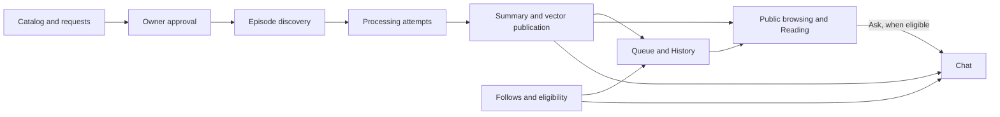

# Implemented features

These documents describe Said on Air as implemented at commit
`d23e52087bdbc83d56440c48dde79a3405d223a1`, inspected on 2026-09-23.
They are written for product and engineering readers.

**Executable source code is the authority for this documentation.** These feature
documents are the accepted description of v1 behavior. The [PRD](../../PRD.md)
owns product goals, shared constraints, and roadmap context, and links here for
feature details. Historical PRD conflicts were superseded when the owner accepted
these documents on 2026-09-23; they are not outstanding requirements or requested
fixes. Older specs and source comments do not override the implementation.

## Feature map

| Feature | What it owns |
|---|---|
| [Identity and access](identity-and-access.md) | Sign-in, session handoff, identity resolution, account switching, and authorization. |
| [Public browsing and sharing](public-browsing-and-sharing.md) | Anonymous access, public catalog, server rendering, unfurls, and crawling. |
| [Channel catalog and requests](channel-catalog-and-requests.md) | Sources, feed preview, channel addition, requests, and channel history. |
| [Follows and content eligibility](follows-and-content-eligibility.md) | Follow relationships, personalized eligibility, and automatic pause. |
| [Owner curation and catalog health](owner-curation-and-catalog-health.md) | Review decisions, management controls, attention queues, and diagnostics. |
| [Episode discovery](episode-discovery.md) | RSS selection, initial import, scheduled/manual checks, and discovery records. |
| [Episode processing and recovery](episode-processing-and-recovery.md) | Transcripts, chunks, attempt state, deadlines, retries, and recovery. |
| [Summary generation and publication](summary-generation-and-publication.md) | Summarization, vectors, publication, replacement, cleanup, and related content. |
| [Personal digest, Queue, and History](personal-digest-queue-and-history.md) | Personalized lists, dates, pagination, counts, and read receipts. |
| [Summary reading experience](summary-reading-experience.md) | Reading presentation, timestamp links, Done, Ask, and return navigation. |
| [Chat and grounded answers](chat-and-grounded-answers.md) | Conversations, scope, retrieval, reranking, answers, and source snapshots. |
| [Reader preferences](reader-preferences.md) | Browser appearance preferences and persisted chat instructions. |

## How the features connect

Discovery records what a feed check found. A processing attempt records one
execution against an episode. Publication makes a summary and vector generation
available together. A digest selects existing summaries for a reader; it does not
generate another AI summary.

An episode can be publicly readable without being eligible for a particular
reader's digest, receipts, or chat. Eligibility is active follows intersected
with approved channels. Pause affects future scheduled discovery, not existing
content or recovery.

## Shared implementation references

- [Web router](../../../apps/web/src/app.tsx) and [API entry point](../../../apps/api/src/index.ts)
  establish actual routes and middleware order.
- [Shared schemas](../../../packages/shared/src/index.ts) define request and response
  shapes. [OpenAPI generation](../../../apps/api/src/lib/openapi.ts) and the
  [API reference page](../../../apps/api/src/routes/docs.ts) expose `/openapi.json`
  and `/docs`; the feature documents explain behavior rather than duplicate the
  entire generated schema.
- [Registry facade](../../../apps/api/src/do/registry.ts) owns shared identities,
  catalog, follows, episodes, runs, attempts, and summaries.
  [User facade](../../../apps/api/src/do/user.ts) owns each user's receipts, chats,
  source snapshots, and chat preferences.
- [API configuration](../../../apps/api/wrangler.jsonc) and
  [web configuration](../../../apps/web/wrangler.jsonc) define environment bindings.
  Deployment/setup procedures remain in [AGENTS.md](../../../AGENTS.md) and the
  [repository README](../../../README.md).
- [Design guide](../../design.md) records design intent; feature pages
  identify observable implementation details and limitations separately.

## Evidence and maintenance

Source links identify the implementing modules; named functions in the prose
locate the relevant behavior. Test sections identify existing automated coverage,
not proof that every interaction or external integration works in deployment.
API tests use the Workers pool with remote bindings disabled and provider/AI/vector
fakes; web tests run in Node and include server/component rendering without a DOM.
See [API test configuration](../../../apps/api/vitest.config.ts) and
[web test configuration](../../../apps/web/vitest.config.ts).

This documentation was prepared by source and test inspection. No live OAuth,
transcript-provider, model-quality, deployed-resource, or browser interaction
verification is implied. Repository check results are reported with the delivery
of this change rather than presented as permanent feature guarantees.

When updating a feature, trace its screen, route, storage/service logic, schemas,
and relevant tests. Update its inspected revision, behavior, evidence, and limitations. Related
features link to the owner of a rule instead of maintaining competing descriptions.
Update the PRD only when goals, shared constraints, feature organization, or roadmap
context change.
