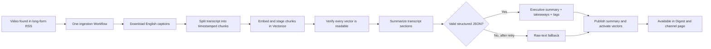

# How a summary actually gets made

2026-09-14 13:24 · Codex · 3 prompts, 8 turns · session `01a0a0f2`

<!-- capture:covers codex-01a0a0f2 -->

Asking the pipeline to explain itself — how one video becomes a summary, whether the chunk summaries are combined into a digest, and what separates a chunk from a section. The question that preceded the sectioning work.

Commits in this window:

- `901037c` feat(api,web): step 3, retire LIVE_OR_UPCOMING
- `bced5b4` docs: step 4, the subordinate specs stop describing a wait for live content

---

### Asked · 2026-09-14 13:24

```text
explain to me how product does summaries for one video
```

### Replied · 2026-09-14 13:24

```text
I’m using the repo’s `using-superpowers` workflow to ground this in the actual implementation, then I’ll trace one video from discovery through transcript, chunks, AI summary, and publication.
```

### Replied · 2026-09-14 13:24

```text
I’m also using the `visualize` skill because the summary pipeline is easiest to understand as a compact flow; I’ll keep the explanation code-grounded rather than turning it into a generic architecture overview.
```

### Replied · 2026-09-14 13:25

````text
For one YouTube video, the product creates one shared summary that every eligible follower can read. It summarizes the transcript itself—not the YouTube page and not the stored vectors.



Here is the detailed path:

1. The video is discovered

The app reads the channel’s long-form YouTube RSS feed. A new video gets an episode record and its own Cloudflare Workflow attempt. Attempts from the same discovery batch are staggered three seconds apart. See [ingestion.ts](/Users/bhaskar/workspace/media-digest-assistant/apps/api/src/lib/ingestion.ts:49).

2. It obtains an English transcript

The Workflow sends only the video’s public watch URL to DownSub, authenticated with the configured secret. It prefers manually created English captions, then automatic English captions, and parses the selected VTT file into timestamped segments. See [downsub.ts](/Users/bhaskar/workspace/media-digest-assistant/apps/api/src/lib/transcripts/downsub.ts:44).

Before continuing:

- Videos under three minutes are skipped.
- Non-English videos are skipped.
- Videos without captions wait for automatic recovery.
- Exhausted transcript credits also produce a recoverable wait.
- Technical errors produce a failed episode attempt.

That classification happens in [ingest.ts](/Users/bhaskar/workspace/media-digest-assistant/apps/api/src/workflows/ingest.ts:156).

3. It creates overlapping transcript chunks

The transcript becomes chunks containing text, start time, and end time. Each chunk is roughly one minute of speech, targets no more than about 400 tokens, has a hard limit of 480 tokens, and overlaps the preceding chunk by one or two caption segments. See [chunk.ts](/Users/bhaskar/workspace/media-digest-assistant/apps/api/src/lib/chunk.ts:19).

The overlap helps preserve ideas that cross a chunk boundary.

4. It embeds the chunks

The app sends batches of up to 20 chunks to Cloudflare Workers AI using `@cf/baai/bge-base-en-v1.5`, producing 768-dimensional vectors. It stores them in Vectorize under the shared `shared-catalog` namespace.

These vectors are primarily for chat retrieval and finding related episodes. They are not what the summarization model reads. See [ai.ts](/Users/bhaskar/workspace/media-digest-assistant/apps/api/src/lib/ai.ts:11) and [ingest.ts](/Users/bhaskar/workspace/media-digest-assistant/apps/api/src/workflows/ingest.ts:388).

The new vectors are initially a staged generation. The Workflow repeatedly reads them back and refuses to publish until every expected chunk is present.

5. It summarizes the timestamped transcript

Chunks are grouped into sections spanning at most 45 minutes. Each section is formatted like:

```text
[0:04:12] The speaker explains...
[0:05:08] They give an example...
```

Each section goes to Cloudflare Workers AI using `@cf/meta/llama-3.3-70b-instruct-fp8-fast`.

The prompt requests:

- An executive summary of at most three sentences
- Three to five concrete takeaways
- The nearest transcript timestamp for each takeaway
- One to eight lowercase topic tags
- No unsupported facts, names, numbers, or timestamps

For a video under roughly 45 minutes, this is normally one summary call. For a 90-minute video, it will normally make section-summary calls and then one final reduction call that combines those section summaries. See [summary.ts](/Users/bhaskar/workspace/media-digest-assistant/apps/api/src/lib/summary.ts:35), [summary prompt](/Users/bhaskar/workspace/media-digest-assistant/apps/api/src/prompts/summary.ts:7), and [Workflow summarization](/Users/bhaskar/workspace/media-digest-assistant/apps/api/src/workflows/ingest.ts:487).

6. It validates the model’s answer

The model must return the expected JSON structure. The application checks the shape itself rather than trusting that parseable JSON is sufficient.

It verifies nonempty text, 3–5 takeaways, 1–8 tags, and timestamps. Invalid or out-of-range timestamps become `null`, so the takeaway remains readable but does not get a misleading jump link.

If the first answer is malformed, the app makes one additional call with a stricter “JSON only” instruction. If that is still malformed, it publishes the model’s raw response as a fallback instead of losing the entire summary. See [summary.ts](/Users/bhaskar/workspace/media-digest-assistant/apps/api/src/lib/summary.ts:78) and [ingest.ts](/Users/bhaskar/workspace/media-digest-assistant/apps/api/src/workflows/ingest.ts:550).

7. It publishes automatically

The Registry stores the summary, activates the staged vector generation, marks the episode available, and records its first summary-availability time in one transaction. There is no human quality-review gate. Related-episode lookup is optional and cannot prevent publication. See [processing.ts](/Users/bhaskar/workspace/media-digest-assistant/apps/api/src/do/registry/processing.ts:193).

The resulting summary is shared globally—there is not a separate AI summary for every user. User-specific data only tracks whether each person has read it. The Digest treats the video as “new” based on when its summary first became available, not when the video was published.

<oai-mem-citation>
<citation_entries>
MEMORY.md:60-71|note=[confirmed approved summary publication digest and related episode behavior]
rollout_summaries/2026-09-09T04-06-19-v5AE-m3_ingestion_ux_contract_alignment.md:15-32|note=[confirmed prior product decisions for summary lifecycle]
</citation_entries>
<rollout_ids>
01a08458-61f3-74a2-bd5d-e209b5dfacdc
</rollout_ids>
</oai-mem-citation>
````

### Asked · 2026-09-14 13:38

```text
am I correct on the following
- summaries are generated for each chunk
- all summaries are combined to create a digest
```

### Replied · 2026-09-14 13:39

````text
Not quite. There are two important distinctions:

- Summaries are **not generated for each transcript chunk**. Chunks are grouped into sections of up to 45 minutes, and one summary is generated per section.
- Those section summaries are combined into **one final episode summary**, not a digest.
- The **digest** is a collection of final episode summaries from followed channels. It does not currently ask AI to combine them into a new overall digest narrative.

So the flow is:

```text
Transcript chunks
    → 45-minute sections
    → section summaries
    → one final video/episode summary
    → included alongside other video summaries in the Digest
```

For a video shorter than 45 minutes, the reduction step is skipped: its single section summary becomes the final video summary.
````

### Asked · 2026-09-14 13:40

```text
what is the difference between a chunk and a sectoin
```

### Replied · 2026-09-14 13:40

````text
A **chunk** is a small piece of transcript; a **section** is a larger group of consecutive chunks.

| | Chunk | Section |
|---|---|---|
| Typical size | About 1 minute | Up to 45 minutes |
| Built from | Caption segments | Multiple chunks |
| Purpose | Vector search and chat retrieval | AI summarization |
| Stored in Vectorize | Yes | No |
| Summarized separately | No | Yes |
| Has timestamps | Start and end time | Contains timestamped chunks |

For example, a 60-minute video might become:

```text
Transcript
├── Chunk 1:  0:00–1:00
├── Chunk 2:  0:55–1:55
├── ...
├── Chunk 45: around 44:00–45:00
└── Remaining chunks: around 45:00–60:00

Section 1 = chunks covering approximately 0–45 minutes
Section 2 = chunks covering approximately 45–60 minutes
```

The app summarizes Section 1 and Section 2 separately, then combines those two answers into one final video summary.

Chunks are deliberately small and slightly overlapping so search can retrieve a precise passage without losing an idea at a boundary. Sections are much larger because they exist to keep long transcripts within manageable summarization requests.
````
